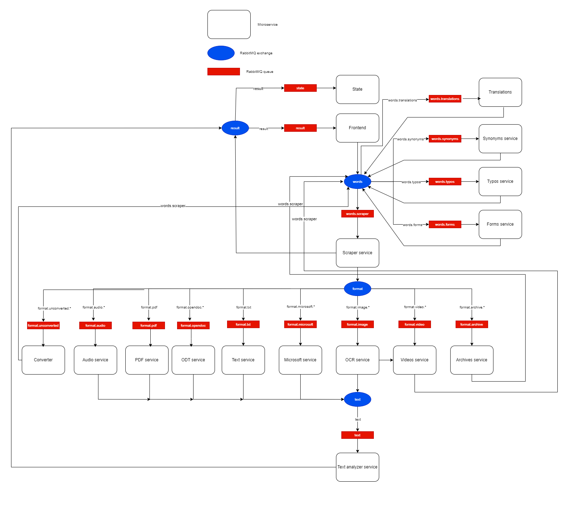

# FileFinder
## Description
This app allows searching for files containing a specified phrase in a directory.
Supported formats:
* text (.txt, .md, .pdf)
* Open Document (.odt, .odf)
* Microsoft (.pptx, .docx)
* Image (.jpeg, .jpg, .png)
* Audio (.mp3, .wav)
* Video (.mp4)
* Archive (.zip, .tar, .gz)

## Running the app
To run the app, run the following command from the project's root directory:

    docker-compose up

You can access the app at

    http://localhost:3000/

## Architecture diagram

## Components

### Full services description is available at [Confluence Documentation](./app-docs/FileFinderDocumentation.pdf)

---
### [Frontend](./frontend)
Desktop app providing graphical interface for interaction with the system.

### [Text Extractor Service](./textExtractor)
Service extracting raw text from files with .txt format.

### [Words Forms Service](./wordsForms)
Service generating list of forms of the words that were given in a phrase by the user.

### [Words Synonyms Service](./wordsSynonyms)
Service generating list of synonyms of the words that were given in a phrase by the user.

### [Words Typos Service](./wordsTypos)
Service generates typos for requested words.

### [Archive Service](./archive_service)
Services extracting files from provided archive path, and sending message for each file back to the Scraper service

### [Audio Service](./audio_service)
Service searching for text in .wav and returning raw text extracted from these files.

### [Converter](./converter)
Service which converts .mp3 and .mp4 files to .wav files.

### [Microsoft Service](./microsoft_service)
Service searching for text in Microsoft format files (.docx, .pptx, .xlsx) and returning raw text extracted from these files.

### [OCR Service](./ocr_service)
Service searching for text in image files (.jpg, .png, ...) and returning raw text extracted from these files.

### [ODT Service](./odt_service)
Service searching for text in OpenDocument format files (.odt, .odf) and returning raw text extracted from these files.

### [PDF Service](./pdf_service)
Service searching for text in PDF files (.pdf) and returning raw text extracted from these files.

### [Scraper Service](./scraper)
Scraper microservice that goes through the directory tree and finds all the files matching formats specified in the query, and sends them to specialized microservices.

### [State Service](./state_service)
Microservice to remove all files created by our system (files extracted from archives and frames extracted from video files).

### [Text Analyzer Service](./textAnalyzer)
Service finding specified words in raw text provided by services specialized in various file formats.

### [Translation Service](./translation)
Service, which translates given phrase to defined subset of languages

### [Video Service](./video_service)
Services extracting files from provided video path, and sending message for each frame back to the Scraper service
